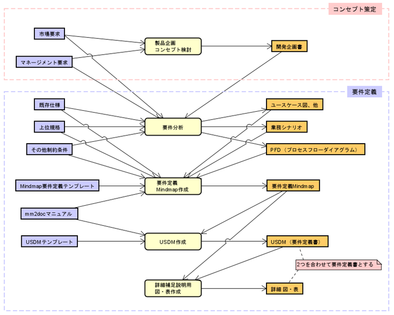

# 要件定義の考え方

## 概要

ここでは、**「抜け漏れのない正確な仕様書（USDM）」** を効率的に作成するために、**「Mindmapによる発想・整理」** と **「ツールによるドキュメント自動生成」** を組み合わせたプロセスを採用しています。

## 全体プロセス (PFD)

要件定義から仕様書作成までの流れは以下の通りです。

1. **製品企画・コンセプト検討**: 何を作るかを決める。
2. **要件分析 (Mindmap)**: 機能や制約を洗い出し、構造化する。
3. **USDM生成 (mm2docs)**: MindmapからUSDM形式のExcelを自動生成する。
4. **詳細化・補足**: 生成されたUSDMに詳細を追記し、図表を加える。
5. **仕様書出力**: 必要に応じてWordやMarkdown形式の仕様書を出力する。

**用語説明 : PFD (Process Flow Diagram)**
> PFDはDFD（データ・フロー・ダイアグラム）を改良したプロセスの表現方法であり、「プロセス」と「成果物」の連鎖を「フロー」でつないで表現します。

## 要件定義の手法

### 1. USDM (Universal Specification Describing Manner)

最終成果物として目指すのは USDM 形式の仕様書です。

USDMは、要求（Requirement）と仕様（Specification）を階層的に整理し、その理由（Why）を明記することで、仕様の抜け漏れを防ぐ技法です。
「要求」に対して「仕様」を導出し、その仕様が必要な「理由」をセットで記述することが特徴です。

> **参考**: [正確な要求記述、要求仕様を定義する技法USDMとは](https://www.eureka-box.com/media/column/a19)

### 2. Mindmapによる要件分析

いきなりExcelの表でUSDMを書き始めるのではなく、Mindmapを使って要件を洗い出します。
Mindmapを使うことで、思考を妨げずにアイデアを広げ、グループ化（構造化）することが容易になります。

#### 分析のアプローチ (FASTなど)

要件を整理する際は、「機能系統図」や「FAST (Function Analysis System Technique)」といった手法を意識します。
「それは何のため？（Why）」「どうやって実現する？（How）」という問いを繰り返すことで、要求と仕様の階層構造を構築します。

#### 機能要件と非機能要件

Mindmapには「機能要件」だけでなく「非機能要件」も記述します。

*   **機能要件**: 何をするものか、どう振る舞うか。
*   **非機能要件**: 性能、品質、セキュリティ、コストなど。

これらを明確に区別し、タグ付け（表記法参照）を行うことで、後の工程で自動的にドキュメント化されます。

## ツールによる自動化

作成したMindmapは、ツール (`mm2docs`) を使用して変換します。
Mindmap上で特定の記法（タグ）を用いることで、ツールが「要求」「仕様」「理由」などを判別し、適切なフォーマット（Excel, Word, Markdown）に出力します。

具体的なMindmapの書き方については、[HowToUse_mm2docs.md](HowToUse_mm2docs.md) を参照してください。
