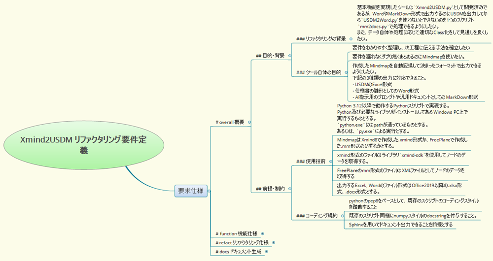
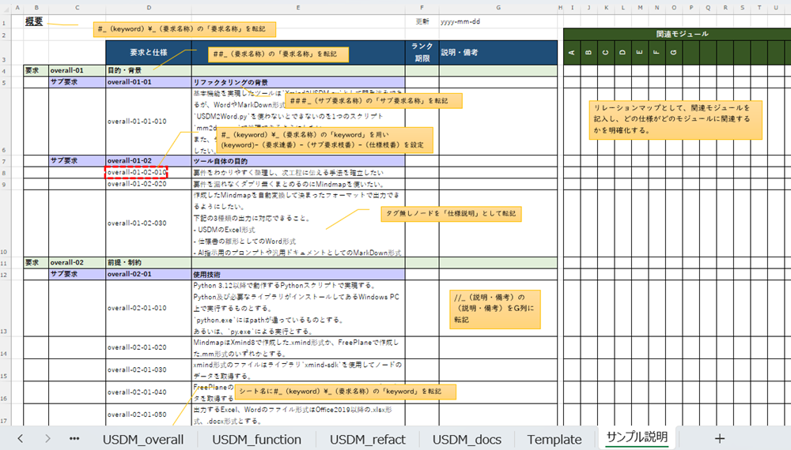
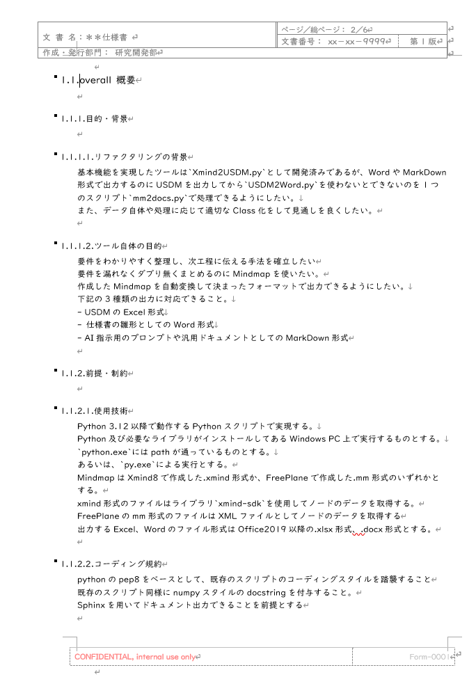

# 要件定義Mindmapの表記方法

## 概要

要件定義Mindmapは、「要求レベル（4段階）」と「仕様（要求内容）」、「理由」、「説明・備考」の項目で構成されます。

各項目はMindmap上の階層構造（親子、兄弟関係）では判別されず、ノードの順序に従い、ノードの頭に付けられたタグ文字によって評価・判別されます。

具体的な要件定義の考え方やプロセスについては、[Concept_RequirementDefinition.md](Concept_RequirementDefinition.md) を参照してください。

## タグの付け方

タグは`#`、`?`、`//`、`!`、`<!--`、`-->`のタグ文字と半角スペースでノードの頭に付与し、その後ろに説明文が続きます。

タグが無いノードは「仕様（要求内容）」とみなされます。

### タグ一覧

表中の`_`（アンダーバー）は「半角スペース」を示します。

|タグ表記|意味|説明・備考|
|:--|:--|:--|
|`#_`（keyword）\_（要求名称）|最上位の要求レベル|USDMに転記される際には、この要求レベル毎に別シートに記載され、keyword（半角英数字推奨）がExcelのシート名や仕様ID番号のprefixとなります。 keywordが省略された場合は、「要求名称」そのものをシート名、ID番号prefixとします。 Word形式、Markdown形式に変換される場合は、`#`の数によって`#`～`####`までの4レベルの見出しとなります。|
|`##_`（要求名称）|第2レベルの要求レベル|USDMに転記される際には、「要求」レベルとして記載されます|
|`###_`（サブ要求名称）|第3レベルの要求レベル|USDMに転記される際には、「サブ要求」レベルとして記載されます|
|`####_`（仕様グループ名称）|第4レベルの要求レベル|USDMに転記される際には、「仕様グループ」レベルとして記載されます|
|タグ無し。（仕様説明文）|仕様の詳細記述文|USDMに転記される際には、「仕様」そのものの記述として記載されます。ノード内改行は、Excelのセル内改行、Word、Markdownの物理改行となります。|
|`?_`（理由）|仕様についてその理由を示す|USDMに転記される際には、「理由」行に記載されます 理由ノードが連続する場合は、1つの理由行内で物理改行で連結されます|
|`//_`（説明・備考）|仕様について補足説明などを記述|USDMに転記される際には、「説明・備考」列に記載されます 説明・備考ノードが連続する場合は、1つの説明・備考内として物理改行で連結されます。|
|`!`|ノードのコメントアウト|`!`で始まるノードは出力対象から除外されます|
|`<!-- ～ -->`|ノードのコメントアウト範囲の開始、終了|`<!--`のノードから`-->`のノードまでは出力対象から除外されます|

## Mindmap変換例

### USDM転記例

USDMに転記した例を示します。

転記後、文字だけの説明ではわかりにくい部分はシートを追加して補足説明用の図や表を加えます。

検討段階で作成したユースケース図やステートマシン図、画面遷移図、ハードウェアのブロック図、シーケンス図、タイミングチャートなどを含めることができます。

### Wordフォーマット転記例

Wordに転記した例を示します。

Wordのテンプレートの書式スタイルとして、「理由」、「備考」が定義されている必要があります。

いくつかのWord文書を1つにまとめたい場合、生成した文書の見出しレベルを「見出し2」以降から階層化したいことがあります。 
この場合、`mmconfig.py`の`head_lv_offset`を1以上の値にすることで階層下げが可能です。デフォルトで`head_lv_offset`は`1`に設定しています。

### Markdown転記例

[Xmind2USDM_Refactoring_SRS.md](samples/Xmind2USDM_Refactoring_SRS.md)

## 要件定義の考え方

[Concept_RequirementDefinition.md](Concept_RequirementDefinition.md) を参照してください。
